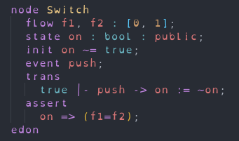

# AltaRica-lang README

AltaRica-lang is an vscode extension to support the `AltaRica` language.

## Features

Syntax Highlighting:

## Requirements

No requirements or dependencies needed.

## Extension Settings

No settings for this extension.

## Known Issues

You can find / report an issues [here](https://github.com/charles66820/altarica-vscode-extension/issues)

## Release Notes

Users appreciate release notes as you update your extension.

### 1.0.0

Initial release with `AltaRica` code Syntax Highlighting
